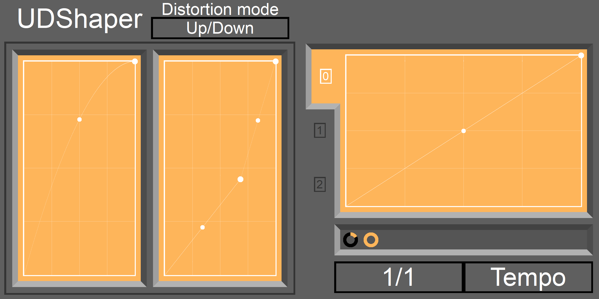

# UDShaper
UDShaper is a [wave shaper](https://en.wikipedia.org/wiki/Waveshaper) audio effect that features two shaping functions which can be applied to the input audio using different mappings. The shaping functions can be designed using a visual graph editor and all their parameters can be controlled by the built-in LFO tool.

*The current state of the UDShaper GUI. The two graph editors on the left define the shaping functions, the Envelope tool one on the right is used to modulate their parameters over time. Check the manual for a detailed guide.*

## Compatibility
UDShaper is a CLAP plugin, which is an open source audio plugin ABI. A list of hosts supporting CLAP can be found [here](https://clapdb.tech/category/hostsdaws). Currently, the plugin is under development and not yet tested for any hosts or systems apart from FL Studio on windows.