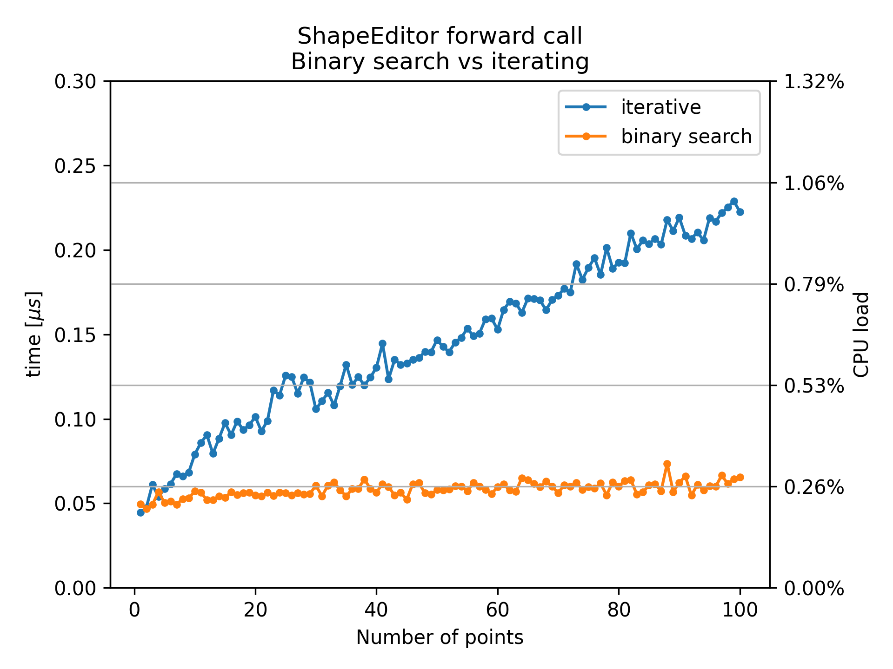

# ShapeEditor::forward performance

### The `ShapeEditor::forward` method
The plugin performance mainly depends on the performance of `ShapeEditor::forward`. This method evaluates a function designed by the user on a visual graph editor. It must be called at least twice per sample to evaluate the shaping functions. Each connected LFO adds one call per sample.\
The ShapeEditor function is broken down into curve segments seperated by *points*, between which the function is interpolated. The first thing to do when evaluating this function is to find the segment that corresponds to the input. The interpolation in this segment can be evaluated afterwards. Therefore the computational cost is dependent on the number of segments in the curve. This dependency is discussed here.\
\
To make UDShaper stand out as a plugin, I wanted to make it possible to modulate the position of points over time. This does also involve changing their x-position over time. Additionally, I wanted points to be able to push other points when they move past them, which makes the search for the correct curve segment challenging, as the position of points depends of the position of neighboring points.

### Performance measurements
To measure the performance, I called the forward method with the input 1 and averaged the processing time over 10000 calls. I repeated this measurement with 1 to 100 segments in the curve.\
The measurements were done on my personal machine. Aparently DAWs do not parallelize individual plugin instances, so the metrics discussed here are not effected by the number of cores, but rather the clock speed of the CPU. The clock speed used to measure the following data is 2.5 GHz.

### Performance evaluation
To assess the performance I give two numbers:\
Firstly the computation time in $\mu s$, which is simply the average time to process `ShapeEditor::forward(1.)`.\
Secondly I give the 'CPU load', which is equal to the CPU load displayed in FL Studio. Audio is processed in buffers of typically a few hundred audio samples. To run in real time, each buffer has only a limited amount of time to be processed. If this time is exceeded, the host tries to play audio faster than it can be processed and audible bugs and disruptions occur. The CPU load gives the percentage of how much of the availabale time per buffer is used.

## Final solution: binary search & iteration hybrid
After some iterations and fixes of design flaws, the best compromise between speed and functionality I could find is the following:\
Points that have constant x-position are processed using a binary search. This is very fast. For points modulated in x-direction however, binary search is not possible. However, it is possible to only process the modulated points that are actually relevant for the input. These 'Islands' of modulated points in between fixed points are processed sequentially.\
\
In this setup, points can push other points, but only if they are also modulated in x-direction. Unmodulated points are fixed and can not be moved by modulated ones.\
\
The algorithm to determine the ShapeEditor function value at a given `x` works as follows:
1. Find the point corresponding to the input (the next point with `point.posX > x`) **assuming no point is modulated** using a binary search.
2. Determine if the resulting point is fixed or if it is inside of an island of modulated points.
3. If it is fixed and the neighbor to the left is also fixed, evaluate the curve segment.\
If it is fixed and one or more points adjacent on the left are modulated **or** if it is modulated itself, settle x-position conflicts on the whole modulated island and process the curve segment afterwards.

*Average time for a single `ShapeEditor::forward` call. One implementations iterates through all points and checks if the x-position overlaps with the previous point. This is how fast modulated islands are processed. The other curve uses a binary search and does not check for x-modulation. This is how fast unmodulated points can be found.*

When no point is modulated in x-direction, this has O(log(n)) time complexity thanks to the binary search. If points are modulated, their exact x-position is only determined if they are of concern for the current input value. This happens in O(n), where n is the number of adjacent modulated points. Their processing time is shown as the blue curve.

## Expected performance
In the best case scenario, where no LFOs are active, `ShapeEditor::forward` is called twice per sample. In this case, the CPU load of the plugin is around $0.5\%$.\
\
In the worst case with ten active LFOs, `ShapeEditor::forward` is called 12 times per sample. Consequently, a CPU load of approximately $12\cdot 0.26\% = 3.12\%$ is the minimum that can be expected.\
\
Only the two ShapeEditors representing the shaping function can have modulated points. It is unlikely someone adds more than 30 modulated points per graph editor, in this case there will be an additional CPU load increase of around one percent.