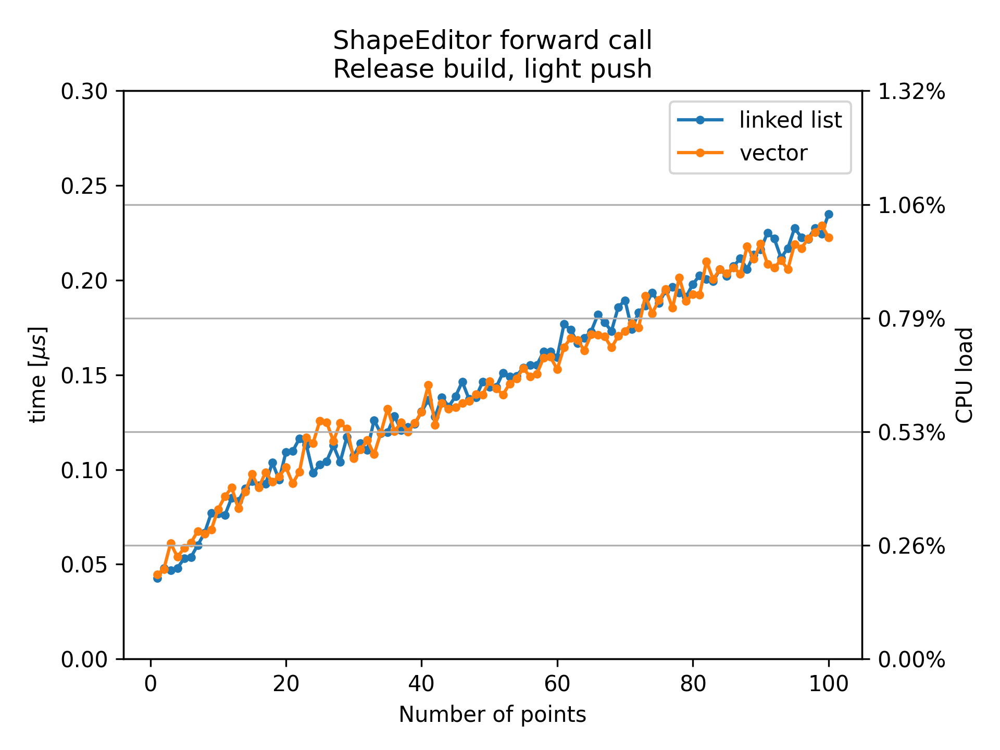

# ShapeEditor::forward performance
When I first tested the plugin, it was performing very poorly. In the following, plugin performance and improvements will be discussed.

### The `ShapeEditor::forward` method
The plugin performance mainly depends on the performance of `ShapeEditor::forward`. This method evaluates a function designed by the user on a visual graph editor. It must be called at least twice per sample to evaluate the shaping functions. Each connected LFO adds one call per sample.\
The ShapeEditor function is broken down into curve segments seperated by *points*, between which the function is interpolated. The first thing to do when evaluating this function is to find the segment that corresponds to the input. The interpolation in this segment can be evaluated afterwards. Therefore the computational cost is dependent on the number of segments in the curve. This dependency is discussed here.

### Performance measurements
To measure the performance, I called the forward method with the input 1 and averaged the processing time over 10000 calls. I repeated this measurement with 1 to 100 segments in the curve.\
The measurements were done on my personal machine with a 12th Gen Intel(R) Core(TM) i5-12500H (2.50 GHz). This processor is probably far below the standard of professional producers.

### Performance evaluation
To assess the performance I give two numbers:\
Firstly the computation time in $\mu s$, which is simply the average time to process `ShapeEditor::forward(1.)`.\
Secondly I give the 'CPU load', which is equal to the CPU load displayed in FL Studio. Audio is processed in buffers of typically a few hundred audio samples. To run in real time, each buffer has only a limited amount of time to be processed. If this time is exceeded, the host tries to play audio faster than it can be processed and audible bugs and disruptions occur. The CPU load gives the percentage of how much of the availabale time per buffer is used.\
\
Since DAWs do aparently not parallelize individual plugin instances, these metrics do not depend on the number of cores, but only on the clock speed.


## Debug vs. release build
The reason for the bad performance I observed in the beginning was that I accidentally built the plugin in debug mode:\
\

*Average time for a single `ShapeEditor::forward` call in the debug and release build. The left y-axis shows the time in $\mu s$, the right y-axis shows the time relative to the duration of one sample, $1s/44100 \approx 23\mu s$.*\
\
That is not surprising but I just found it interesting how much of a difference it makes.

## Major design flaw fixed
Inside `ShapeEditor::forward`, it is iterated through the linked list containing the ShapePoints until a point with an x-position higher than the input is found. Because the x-position can be modulated, every point used to check if the x-position of the next point is modulated beyond its own position:
```C++
  // In ShapePoint:
  const float getPosX(double* modulationAmplitudes = nullptr)
  {
    // Rightmost point must always be at x = 1;
    if (next == nullptr)
    {
      return 1;
    }

    float x = posX.get(modulationAmplitudes);
    // This propagates through the whole list:
    float nextX = next->getPosX(modulationAmplitudes);
    return (x > nextX) ? nextX : x;
  }
```
Consequently, at every point the whole list starting from that point is evaluated and O(2) time complexity in the number of points is expected. This is incredibly stupid and can easily be done in linear time. Instead of checking for the next point, I let it check for the previous point, which has already been evaluated in the loop.


*Average time for a single `ShapeEditor::forward` call in the release build.\
`init setup` is the previous implementation. In `no push` I just quoted the next->getPosX out and points can be moved freely. `light push` is a variation of the previous implementation that does not check for points ahead but uses the points already evaluated and does therefore not slurp up $40\%$ of the CPU by double checking every position a hundret times.*
## Vector vs linked list

*Average time for a single `ShapeEditor::forward` call. Information about curve segments is either stored in a linked list or a vector.*\
\
Information about curve segments was originally stored in a linked list. I thought that a vector might be faster because the elements are stored next to each other in memory and are cached together but aparently there is no difference to a linked list. Apart from performance, using a vector is still safer and cleaner though, so I will keep the changes.

## TODO Binary search
Since the position of points depends on the position of the previous point, binary search is not possible. It would be possible to switch to binary search if no point is modulated. Maybe it would be best to not have points interact with each other, so binary search is always possible. The next step will be to find out if binary search is worth it to drop the 'push' feature.

## Expected performance
The best case scenario are simple shaping functions, no modulation and reasonable audio input. (A sine wave with amplitude 1 for example has an average value of $2/\pi \approx 0.64$. Since the ShapeEditor forward does only check points until the input value is reached, inputting an average of $0.64$ can effectively reduce the computational cost.)\
In this scenario it is realistic that the plugin processes at $0.5\%$ CPU load.\
\
It is unlikely anyone adds more than 30 points to a graph. For the worst case lets say there are 30 points on each shaping function and LFO curve. All LFOs are active and the input is always high, as in a square wave with amplitude 1. In this case the plugin would use around $0.5\%$ per forward call, $6\%$ in total. I would like to decrease this further but I believe it is reasonable for now.
