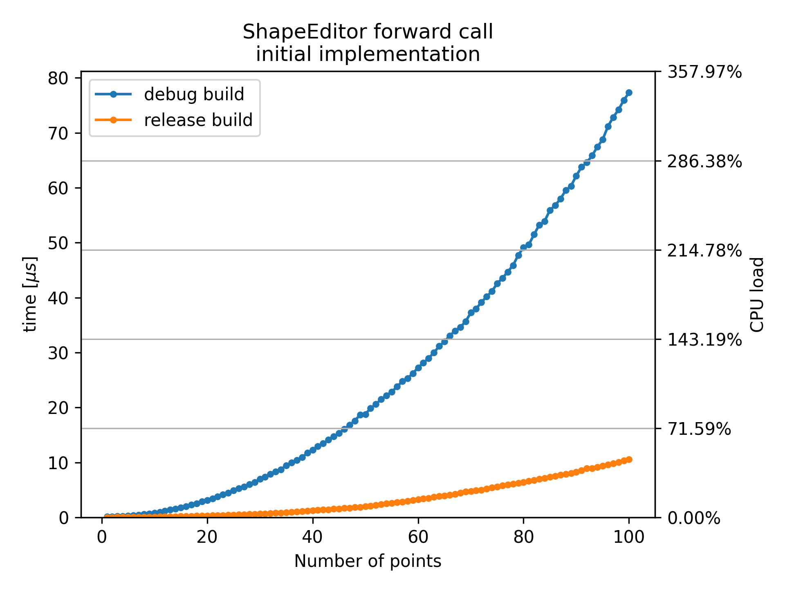
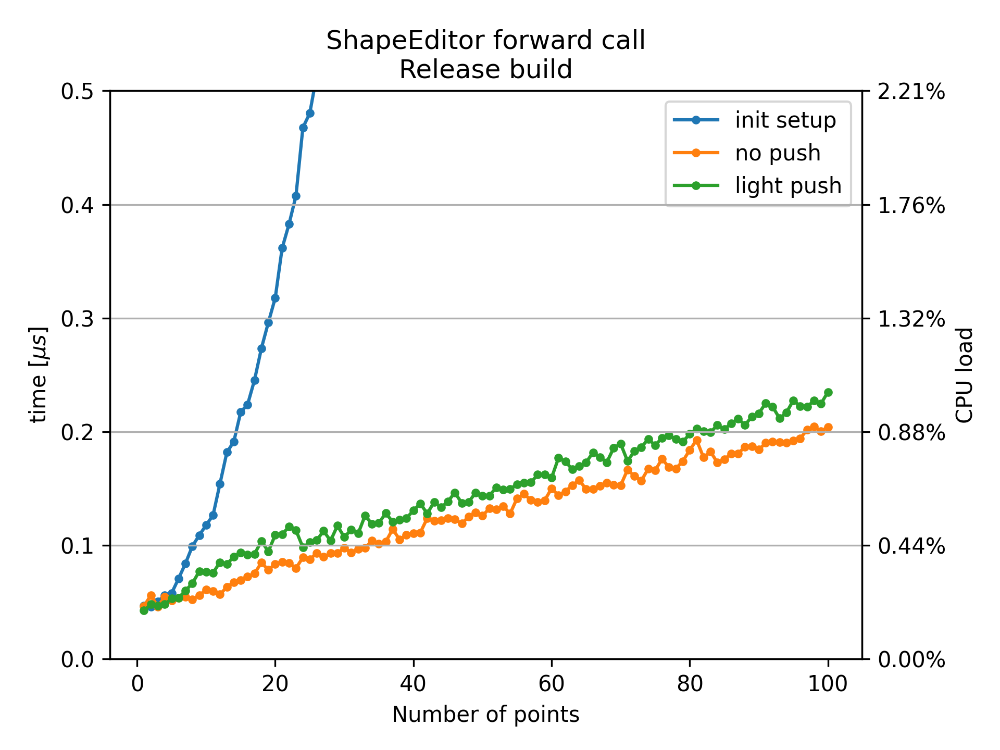

# ShapeEditor::forward performance
The plugin performance mainly depends on the performance of `ShapeEditor::forward`. It must be called at least twice per sample to evaluate the shaping functions. Each connected LFO adds one call per sample. To measure the performance, I called the forward method with the input 1 and averaged the processing time over 10000 calls. I repeated this measurement with 1 to 100 points in the curve.\
\
The reason for the bad performance I observed in the beginning was that I accidentally built the plugin in debug mode:\
\

*Average time for a single `ShapeEditor::forward` call in the debug build. The left y-axis shows the time in $\mu s$, the right y-axis shows the time relative to the duration of one sample, $1s/44100 \approx 23\mu s$.*\
\
Inside `ShapeEditor::forward`, it is iterated through the linked list containing the ShapePoints until a point with an x-position higher than the input is found. Because the x-position can be modulated, every point used to check if the x-position of the next point is modulated beyond its own position:
```C++
  // In ShapePoint:
  const float getPosX(double* modulationAmplitudes = nullptr)
  {
    // Rightmost point must always be at x = 1;
    if (next == nullptr)
    {
      return 1;
    }

    float x = posX.get(modulationAmplitudes);
    // This propagates through the whole list:
    float nextX = next->getPosX(modulationAmplitudes);
    return (x > nextX) ? nextX : x;
  }
```
Consequently, at every point the whole list starting from that point is evaluated and O(2) time complexity in the number of points is expected. This is incredibly stupid and can easily be done in linear time. Instead of checking for the next point, I let it check for the previous point, which has already been evaluated in the loop.


*Average time for a single `ShapeEditor::forward` call in the release build.\
`init setup` is the previous implementation. In `no push` I just quoted the next->getPosX out and points can be moved freely. `light push` is a variation of the previous implementation that does not check for points ahead but uses the points already evaluated and does therefore not slurp up $40\%$ of the CPU by double checking every position a hundret times.*\
\
With the new 'push' implementation, the processing time increases roughly by $2\mu s$ per 100 points. A CPU load of $1\%$ per forward call is not very good, in the worst case of ten connected LFOs, this would lead to $12\%$ CPU load per UDShaper instance. It is unlikely anyone adds more than 30 points though, plus the average input is lower than the input of 1 used for measuring performance, which will also increase the performance on audio. I will still try to improve this, the next step will be to get rid of the linked list and use a vector instead, to align ShapePoints in memory and make better compiler optimizations possible.
